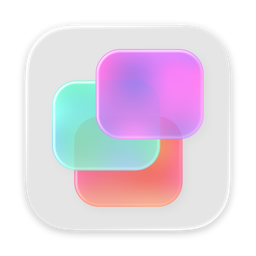
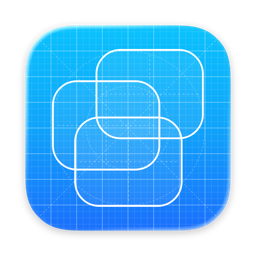
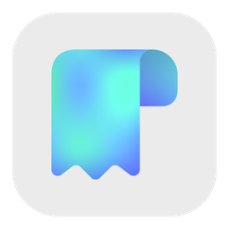
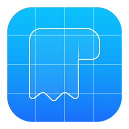

# blueprint

Turn your app icon into a blueprint version, like Xcode's icon, for your debug builds.

Works with Icon Composer `.icon` files and classic `.appiconset` folders.

<p align="center">
  
  &nbsp;&nbsp;&nbsp;&nbsp;
  
</p>

<p align="center">
  
  &nbsp;&nbsp;&nbsp;&nbsp;
  
</p>

## Install

With [Homebrew](https://brew.sh), from [MustafaNatur/homebrew-tap](https://github.com/MustafaNatur/homebrew-tap):

```bash
brew install mustafanatur/tap/blueprint
```

Or from source:

```bash
git clone https://github.com/MustafaNatur/blueprint.git
cd blueprint
make install
```

This puts `blueprint` in `~/.local/bin`. Make sure that folder is on your `PATH`.

Requires macOS 14+ and Xcode 26+.

## Use

Pass the path to your icon:

```bash
blueprint path/to/AppIcon.icon
blueprint path/to/Assets.xcassets/AppIcon.appiconset
```

The blueprint is saved in the same format:

- **`.icon`:** `AppIconDebug.icon` in the folder you ran the command from, opened in Icon Composer.
- **`.appiconset`:** `AppIconDebug.appiconset` next to the original, in the same asset catalog, shown in Finder.

Then set it as the app icon of your Debug configuration in Xcode: **Primary App Icon Set Name** (`ASSETCATALOG_COMPILER_APPICON_NAME`).

## Options

| Option | Default | |
|---|---|---|
| `-o`, `--output` | see above | Where to save the blueprint. |
| `--color` | `#0AC2FC,#10A3FA,#1A6FFB` | Background colors, top to bottom. |
| `--line-width` | `9` | Outline width. |
| `--no-grid` | | Leaves out the grid lines. |
| `--no-open` | | Doesn't open the result. |

## Good to know

- **How a flat `.appiconset` icon is traced.** A flat image has no layers, so blueprint first finds the shapes in it: from the background color, or with Vision's subject lifting when the background is busy. It outlines them, and adds the edges inside them, like overlaps and holes.
- **Every slot is kept.** Dark and tinted variants, and every size of a macOS icon set, get the blueprint too, so it looks the same everywhere.
- Running `blueprint` again replaces the blueprint it drew before. It never overwrites any other icon.
